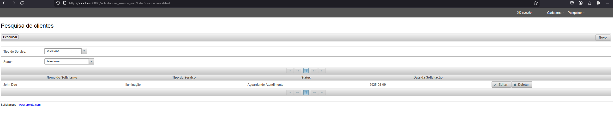
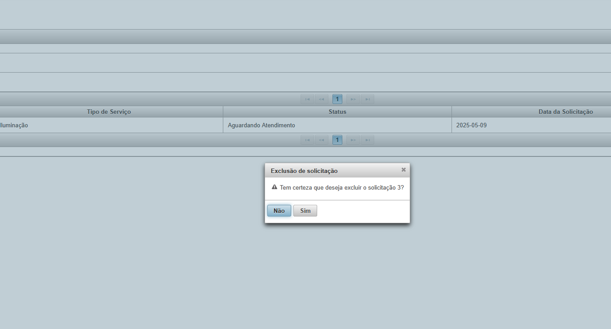
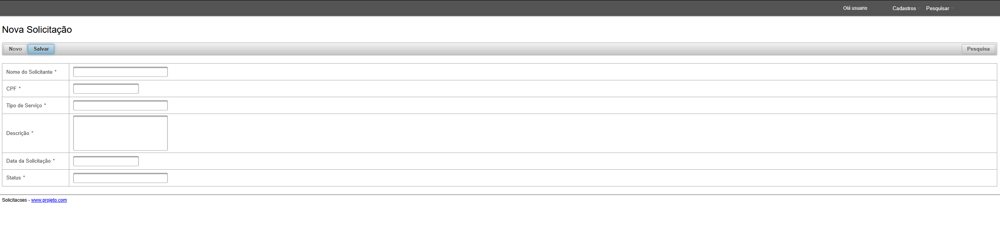
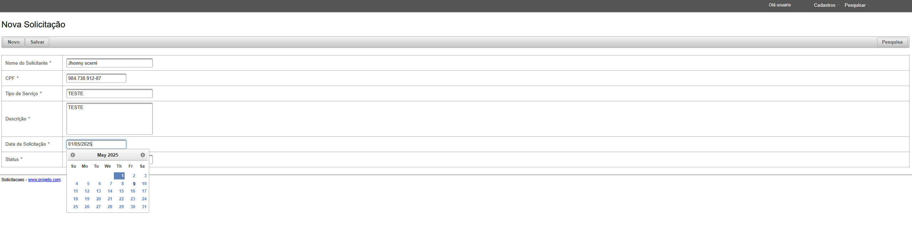

README.md# Sistema de Gerenciamento de Solicitações

## Visão Geral
Este projeto é uma aplicação web para gerenciar solicitações de serviços. Ele permite criar, editar, excluir e listar solicitações. A aplicação segue a arquitetura MVC (Model-View-Controller) e utiliza tecnologias modernas para o desenvolvimento de aplicações Java.

## Tecnologias Utilizadas
- **Java**: Linguagem de programação principal.
- **JSF (JavaServer Faces)**: Framework para construção da interface do usuário.
- **PrimeFaces**: Biblioteca de componentes ricos para JSF.
- **OmniFaces**: Biblioteca utilitária para JSF.
- **Hibernate**: Framework ORM (Mapeamento Objeto-Relacional) para interação com o banco de dados.
- **MySQL**: Banco de dados relacional para armazenamento de dados.
- **C3P0**: Biblioteca para pool de conexões com o banco de dados.
- **Maven**: Ferramenta de automação de build e gerenciamento de dependências.
- **IntelliJ IDEA**: IDE recomendada para desenvolvimento.

## Pré-requisitos
Antes de rodar o projeto, certifique-se de ter instalado:
1. **JDK (Java Development Kit)**: Versão 8 ou superior.
2. **Apache Maven**: Para construir o projeto.
3. **MySQL**: Banco de dados configurado e em execução.
4. **Servidor de Aplicação**: Apache Tomcat 9 ou superior.

## Configuração do Banco de Dados
1. Crie o banco de dados `teste` no MySQL:
   ```sql
   CREATE DATABASE teste;

2. Crie a tabela solicitacao:
   ```sql
   CREATE TABLE solicitacao (
    id BIGINT AUTO_INCREMENT PRIMARY KEY,
    nomeSolicitante VARCHAR(100) NOT NULL,
    cpf VARCHAR(14) NOT NULL,
    tipoServico VARCHAR(50) NOT NULL,
    descricao TEXT NOT NULL,
    dataSolicitacao DATE NOT NULL,
    status VARCHAR(50) NOT NULL
    );


## Atualize as configurações de conexão no arquivo src/main/resources/META-INF/persistence.xml:
    <property name="javax.persistence.jdbc.url" value="jdbc:mysql://localhost/teste"/>
    <property name="javax.persistence.jdbc.user" value="root"/>
    <property name="javax.persistence.jdbc.password" value="sua_senha"/>

## Como Rodar o Projeto
Clone o Repositório:


git clone https://github.com/seu-repositorio/sistema-solicitacoes.git
cd sistema-solicitacoes
Construa o Projeto: Execute o comando Maven para construir o projeto:


    mvn clean install
    Implante no Tomcat:


    Copie o arquivo WAR gerado na pasta target para a pasta webapps do Tomcat.
    Inicie o servidor Tomcat.
    Acesse a Aplicação: Abra o navegador e acesse:
    http://localhost:8080/sistema-solicitacoes

## Funcionalidades
    Criar Solicitação: Adicionar uma nova solicitação de serviço.
    Editar Solicitação: Atualizar solicitações existentes.
    Excluir Solicitação: Remover solicitações.
    Listar Solicitações: Visualizar todas as solicitações com filtros.

## Solução de Problemas
    Certifique-se de que o banco de dados está em execução e acessível.
    Verifique as credenciais do banco de dados no arquivo persistence.xml.
    Consulte os logs do Tomcat para identificar erros de implantação.

## Imagens do sistema
